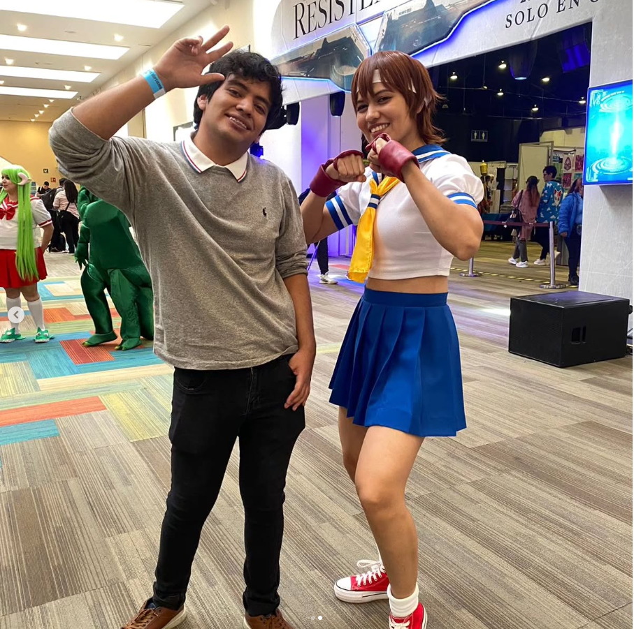

# Emiliano Sanchez Celis

#### Soy Emi, soy un fan a morir de los juegos retro pero especificamente me encantan los de pelea por su alto ambiente competitivo adjunto a la logica que tienen.

#### Decidi estudiar la carrera de desarrollo de videojuegos debido a que quiero hacer algo que las personas puedan disfrutar a la par de que tenga corazon, ya sea algo propio o hecho en conjunto. Mi principal aficion acabando la carrera es trabajar como desarrollador en Capcom o dirigir mi propio proyecto adquiriendo habilidades por el camino.

# Pasatiempos

1. Me gusta experimentar con otros medios mas allá del programar como el arte y conceptualizacion de un juego en cuanto a lo psicologico.

1. Jugar juegos de pelea que me encantan mucho y tomarme el tiempo de estudiarlos

1. Escuchar y trabajar el proyectos de musica para poder verlo de otra manera dentro del videojuego, pero personalmente em gusta tanto el rock, rock pesado, edm y pop japones de los 80s

# Enlaces de contacto

- ### Discord (bmp_is_real)
- ### Correo (emsace16@gmail.com)
- ### Instagram (https://www.instagram.com/emi_volnutt/?next=%2F)
- ### Itch.io (https://realbmp.itch.io)

# ENTREGABLES 

[Apuntes](mds/apuntes.md)

[Practica 2](mds/ramas-fusiones.md)

[Practica 3](mds/etiquetas.md)

[Practica 4](mds/primer-parcial.md)

[Practica 6](mds/videojuego.md)

[Practica 7](https://emicelis.github.io/entregas_lenguajes_interpretados/practica-7.html)