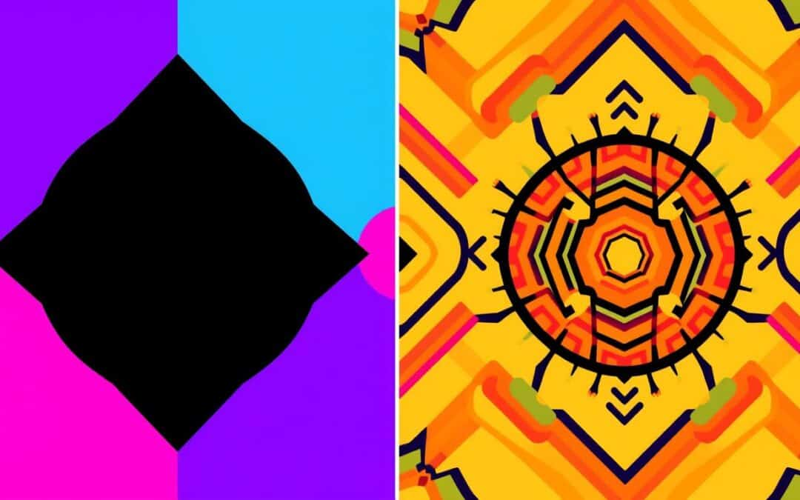
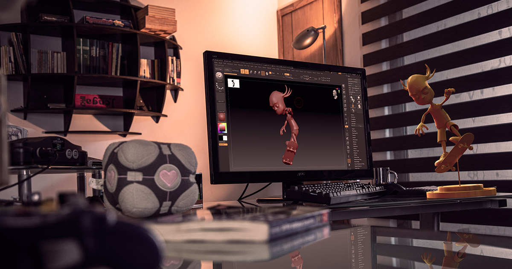
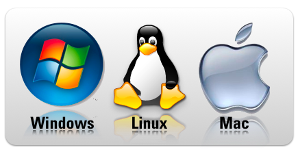
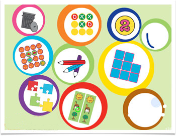

# Asignaturas 3DEVs

## Principios de Composición y Diseño

### MELO ORTIZ D ORA ROBERTO

Los temas generales de la materia hablan un poco sobre la teoria de imagen en cuento al formato y como es que este influye directamente en el marketing como otros medios directos a los videojuegos.

### OLIVAR ARAUJO ANA GUADALUPE

## Diseño de Videojuegos

En esta materia hemos visto las bases para la pre-producción de un videojuego en cuanto al diseño de niveles, narrativa, estetica entre otros.

### ARBONA GARCIA ALCIDES

## Sistemas Operativos y Redes 

Temas generales relacionados a los sistemas operativos desde Windows, Linux, Mac, entre otros. A la par de ver como es que se aplican en otros medios sinedo más eficientes o no.

### GUERRERO TRONCOSO EDUARDO IGNACIO

## Proyecto Semestral: Desarrollo de Aplicaciones Interactivas

Vemos la programación dirigida a objetos directamente a la implementación en aplicaciones interactivas para hacer juegos moviles.

